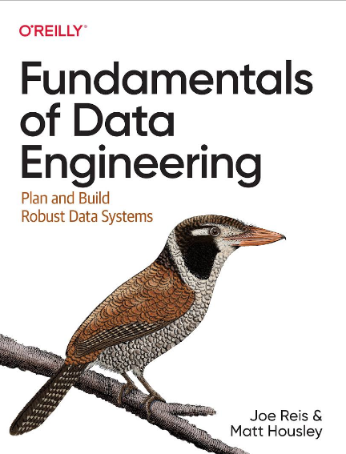

# Fundamentals of Data Engineering

## 

**Table of Contents**

1. [Part1. 데이터 엔지니어링 개요]()

2. [Part2. 데이터 엔지니어링 라이프사이클]()

3. [Part3. 좋은 데이터 아키텍처 설계]()

4. [Part4. 데이터 엔지어링 라이프사이클 전반에 걸친 기술 선택]()

5.  [Part5. 데이터 소스 & 데이터 생성]()

6.  [Part6. 데이터 저장]()

7.  [Part7. 데이터 수집]()

8.  [Part8. 데이터 변환 & 쿼리 & 모델링]()

9.  [Part9. 데이터 분석 & ML, Reverse ETL]()

10.  [Part10. 데이터 보안]()

11.  [Part11. 데이터 엔지니어링의 미래]()

12.  [직렬화 및 압축 기술]()

13.  [클라우드 네트워킹]()
