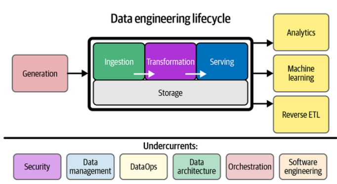

# Part 2. 데이터 엔지니어링 라이프사이클

https://learning.oreilly.com/library/view/fundamentals-of-data/9781098108298/ch02.html#the_data_lifecycle_versus_the_data_engi

#### 데이터 엔지니어링 수명 주기란?

소스 시스템에서 데이터를 가져와 저장하여 데이터 엔지니어링 수명 주기를 시작합니다. 다음으로 데이터를 변환한 다음 분석가, 데이터 과학자, ML 엔지니어 및 기타 사용자에게 데이터를 제공하는 중앙 목표로 진행합니다. 실제로 스토리지는 데이터가 처음부터 끝까지 흐르기 때문에 라이프사이클 전반에 걸쳐 발생합니다. 따라서 다이어그램은 스토리지 "단계"를 다른 단계를 뒷받침하는 기반으로 보여줍니다.

일반적으로 중간 단계(저장, 수집, 변환)는 약간 뒤죽박죽이 될 수 있습니다. 괜찮습니다. 데이터 엔지니어링 수명 주기의 고유한 부분을 분리했지만 항상 깔끔하고 연속적인 흐름은 아닙니다. 수명 주기의 다양한 단계가 반복되거나, 순서 없이 발생하거나, 겹치거나, 흥미롭고 예상치 못한 방식으로 엮일 수 있습니다.

연기보안, 데이터 관리, DataOps, 데이터 아키텍처, 오케스트레이션 및 소프트웨어 엔지니어링과 같은 데이터 엔지니어링 수명 주기의 여러 단계를 가로지르는 저류 ( 그림 2-1 , 하단) 가 기반이 됩니다. 데이터 엔지니어링 수명 주기의 어떤 부분도 이러한 저류 없이 제대로 작동할 수 없습니다.
---
#### Source System
  - 고려 사항

---
#### Storage
  - 고려 사항

---
#### Ingestion
  - Batch
  - Streaming
  - Pull vs Push

---
#### Transformation

----
#### Serving
  - Analysis
  - ML
  - Reverse ETL

---
#### Security

---
#### Management
----
#### DataOps
  - Automation
  - Observability and Monitoring
  - Incident Response
----
#### Architecture

----
#### Orchestration

----
#### Software enginnering
    - IaC
    - Pipeline as a Code